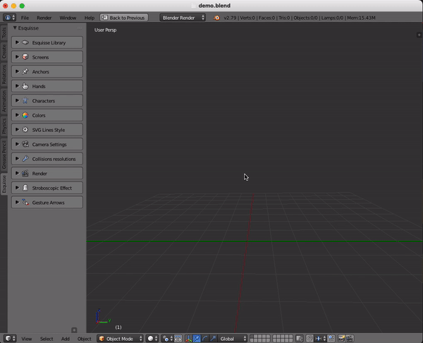
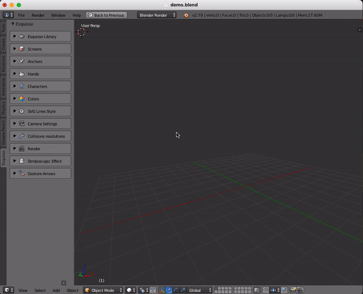
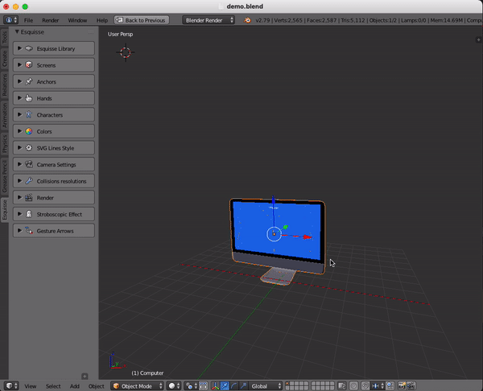
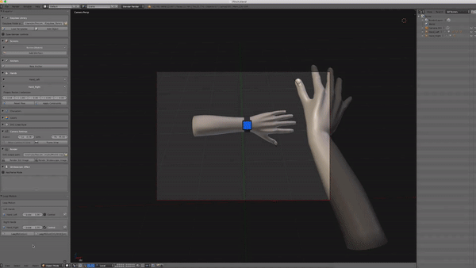
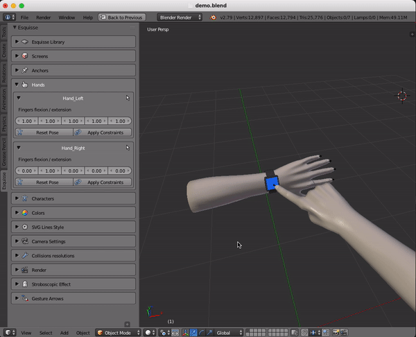
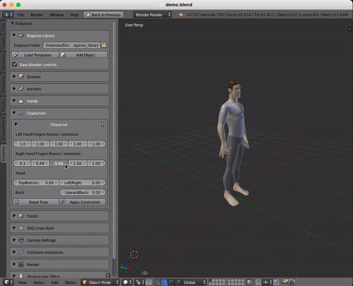
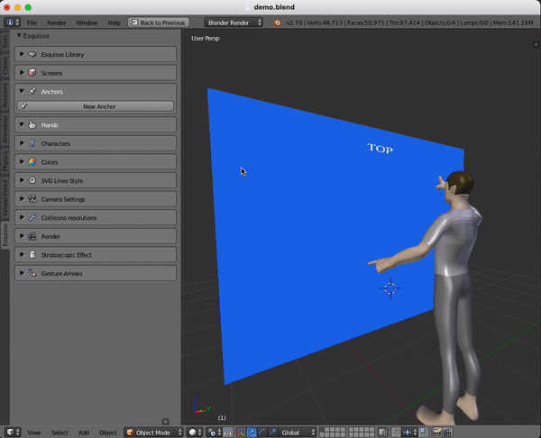
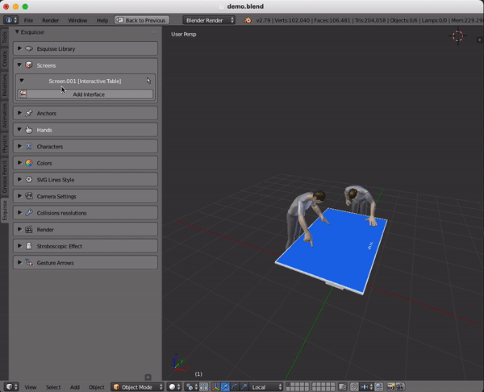
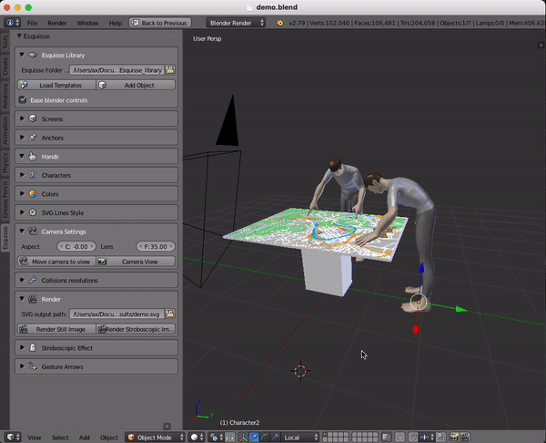
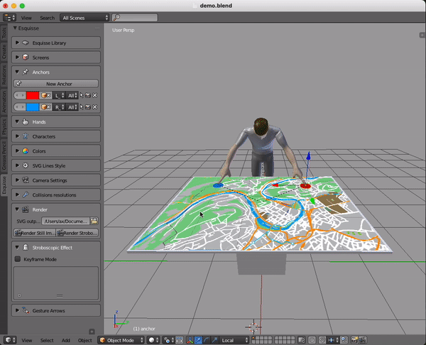

# Esquisse: Using 3D Models Staging to Facilitate the Creation of Vector-based Trace Figures

[Axel Antoine](https://axantoine.com/),
[Sylvain Malacria](http://www.malacria.com/),
[Nicolai Marquardt](http://www.nicolaimarquardt.com/) and
[Géry Casiez](https://cristal.univ-lille.fr/~casiez/). 2019

## About

Esquisse is an add-on for the 3D modeling software Blender. 
It provides an innovative 3D model staging workflow, with specific interaction techniques that facilitate 3D staging through kinematic manipulation, anchor points and posture tracking. 
Our embedded rendering algorithm (including stroboscopic rendering effects) creates vector-based trace figures of 3D scenes. 

Please refer to the publication for more details: [HAL](https://hal.archives-ouvertes.fr/hal-02293837)

If you use Esquisse, of modify it for academic purposes, please cite our paper.

	@InProceedings{10.1007/978-3-030-29384-0_30,
		author="Antoine, Axel and Malacria, Sylvain and Marquardt, Nicolai and Casiez, G{\'e}ry",
		editor="Lamas, David and Loizides, Fernando and Nacke, Lennart and Petrie, Helen and Winckler, Marco and Zaphiris, Panayiotis",
		title="Esquisse: Using 3D Models Staging to Facilitate the Creation of Vector-Based Trace Figures",
		booktitle="Human-Computer Interaction -- INTERACT 2019",
		year="2019",
		publisher="Springer International Publishing",
		address="Cham",
		pages="496--516",
		abstract="Trace figures are contour drawings of people and objects that capture the essence of scenes without the visual noise of photos or other visual representations. Their focus and clarity make them ideal representations to illustrate designs or interaction techniques. In practice, creating those figures is a tedious task requiring advanced skills, even when creating the figures by tracing outlines based on photos. To mediate the process of creating trace figures, we introduce the open-source tool Esquisse. Informed by our taxonomy of 124 trace figures, Esquisse provides an innovative 3D model staging workflow, with specific interaction techniques that facilitate 3D staging through kinematic manipulation, anchor points and posture tracking. Our rendering algorithm (including stroboscopic rendering effects) creates vector-based trace figures of 3D scenes. We validated Esquisse with an experiment where participants created trace figures illustrating interaction techniques, and results show that participants quickly managed to use and appropriate the tool.",
		isbn="978-3-030-29384-0"
	}

## Demo 

Please refer to the wiki for a detailed tutorial on how to use Esquisse.

##### Load a template scene | Load an object from the library

##### Move an object using the default Blender controls or the leap motion

##### Use sliders to modify the hand or avatar posture

##### Use the anchor system to modify postures | Embed 2D SVG interfaces on screen objets

##### Render a SVG file with or without a movement effect

If you know nothing about Blender:

* Watch the [Selection tool](https://cloud.blender.org/p/blender-inside-out/560414b7044a2a00c4a6da9b) video tutorial (first half)
* then watch the [Transform tool](https://cloud.blender.org/p/blender-inside-out/560414b7044a2a00c4a6da9c) video tutorial

## Build Esquisse

**Note:** the build and installation processes are written for macOS, feel free to adapt them to another system.

**Warning:** In the following sections, pleace be carefull to match the python version called by the makefiles and the python version of Blender using pyenv for example (Blender 2.79 should be using python 3.5.3).

### CGAL
Esquisse uses [CGAL](https://www.cgal.org) to export SVG files.
We need to build a wrapper to call specific C++ functions in python which is done using [swig](http://www.swig.org).

##### 1. Install prerequisites
* Install CGAL using HomeBrew

		> brew install cgal

* Install swig using HomeBrew or MacPorts on your computer

		> brew install swig

##### 2. Building the wrapper
* Go into folder `wrapper_cgal` 
* Modify the path to the CGAL library in `setup.py` (probably update the version)
		
		> library_dirs = ['/usr/local/Cellar/cgal/**X.X**/lib']

* run Makefile
			
		> make

##### 3. Install the wrapper into Esquisse
* copy `mycgal.py` and `mycgal.so` into `code/Esquisse/cgal`

		> test

### svg.path
Esquisse uses [svg.path](https://pypi.org/project/svg.path/) to export SVG files.

##### 1. Getting svg.path
* Install svg.path using pip

		> pip3 install svg.path

##### 2. Installing svg.path into Esquisse
* The module downloaded should be located in your python installation folder (probably `/usr/local/lib/python3.X`)
* Open the the directory `site-packages` inside the python folder
* Copy `svg/path/parser.py` and `svg/path/path.py` into the folder `code/Esquisse/svg`.

### Polygon3
Esquisse uses [Polygon3](https://pypi.org/project/Polygon3/) to export SVG files.

##### 1. Getting Polygon

* Install Polygon3 using pip

		> pip3 install Polygon3

##### 2. Installing Polygon3 into Esquisse
* The module downloaded should be located in your python installation folder (probably `/usr/local/lib/python3.X`)
* Open the the directory `site-packages` inside the python folder
* Copy `Polygon/Polygon.so`, `Polygon/Utils.py` and `Polygon/__init__.py`  into the folder `code/Esquisse/Polygon`.

### OpenCV
Esquisses uses [OpenCV](https://pypi.org/project/pyopencv/) to manipulate images.

##### 1. Getting OpenCV
* Install opencv using pip

		> pip3 install opencv-python

##### 2. Installing Polygon3 into Esquisse
* The module downloaded should be located in your python installation folder (probably `/usr/local/lib/python3.X`)
* Open the the directory `site-packages` inside the python folder
* Copy the content of folder `cv2`  from the pip installation into the folder `/code/Esquisse/cv2`.

### LeapMotion (optional)
Esquisses uses [LeapMotion](https://www.leapmotion.com) to manipulate 3D hands.

##### 1. Getting LeapMotion library
* Download the python SDK from the LeapMotion website
* Move the downloaded files `Leap.h`, `LeapMath.h`, `Leap.i` and `libLeap.dylib` into `wrapper_LeapMotion` folder

##### 2. Building the wrapper
* go in folder `wrapper_LeapMotion` and run Makefile
> make

**Warning:** Be carefull to match the python version called by Makefile and the python version of Blender

##### 3. Installing the wrapper into Esquisse
* copy `Leap.py`, `libLeap.dylib` and `Leap.so` into `/code/Esquisse/LeapMotion`

## Install Esquisse into Blender  

### Create the add-on
Simply create a zip archive of the `code/Esquisse` folder after following the buid process.

**Note:** You can also use the provided release on the repo.

### Install the add-on in Blender
Open Blender preferences (`Cmd`+`,`) and Add-ons tab. Click on "Install Add-on from file"  and choose created the zip file.
Then click on the checkbox to enable Esquisse  

**Warning:** if Esquisse was already installed in Blender, first de-install it by clicking the remove button. It is not compulsory but you can experience side-effects otherwise.

**Note:** to make the installation process automatic, please have a look at the files **code/start_addon.py** and **code/run_addon.sh** that handle the process of zipping, moving the addon into the right folder in Blender.

